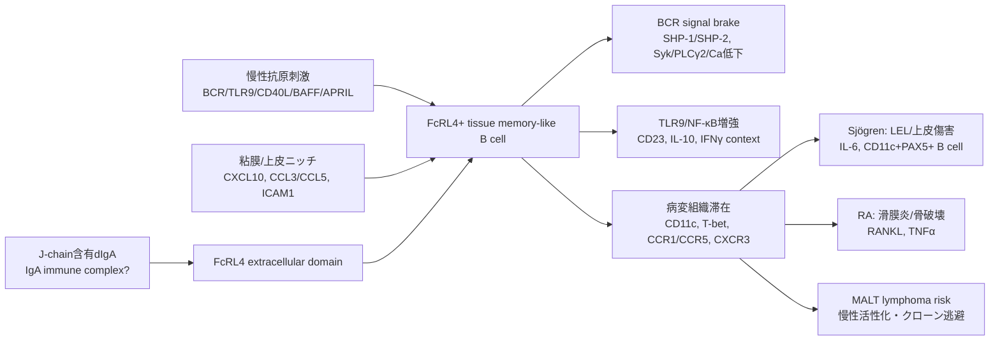

# FcRL4の病態作用機序まとめとFigure候補

作成日: 2026-07-21

## このメモの目的
FcRL4について、現時点で文献から分かっている病態への作用機序を整理する。特に、FcRL4を「単なる病変B細胞マーカー」ではなく、病態局所B細胞stateを作る機能分子として見られるかを確認する。

また、論文内で説明に使いやすいFigure候補を整理する。図そのものの再利用は各論文のライセンス確認が必要なため、このメモでは原則としてFigureリンクを添付し、どの図を見れば何が分かるかを記載する。

## 一言結論
FcRL4は、現在の理解では次のような分子である。

```text
FcRL4は、粘膜/病変組織の慢性活性化B細胞に出るIgA結合性の免疫調節受容体で、
BCRシグナルを抑える一方、TLR9/NF-κB系やSrc kinase文脈では活性化寄りにも働きうる。
Sjögren唾液腺では上皮近傍のFcRL4+ B細胞がLEL、IL-6、CD11c/T-bet/TACI/NF-κB signature、MALT lymphoma riskと結びつき、
RA滑膜ではRANKL/TNFα産生、IgA/citrullinated antigen反応性、骨破壊に結びつく。
```

したがってFcRL4は、単なる住所標識ではなく、**慢性抗原刺激、IgA/immune complex、TLR9、上皮/滑膜ニッチをつなぐ病態B細胞state marker兼調節受容体**として扱うのがよい。

ただし、FcRL4刺激が常に抑制的に働くとは言えない。BCRは抑えるが、TLR9/NF-κBを強める報告があるため、anti-FcRL4 agonistやFcRL4 x CD22のFCRL4 armでは、TLR7/9、CD40L、BAFF/APRIL、IgA immune complex存在下の逆活性化を必ず見る必要がある。

## 全体モデル


## 機序1: 組織常在/粘膜記憶B細胞stateを示す

### 分かっていること
FcRL4は、ヒトでは主にmemory B cellの一部に発現し、特に粘膜関連リンパ組織や上皮近傍のB細胞に偏る。古典的なCD27+ memory B cellとは重ならない部分も大きく、CD27陰性memory-like B cell、tissue-like memory B cell、慢性刺激を受けたB細胞stateとして理解されてきた。

JEM 2005の論文では、FcRH4/FcRL4+ memory B cellsは大型で、CD69、CD80、CD86を発現し、CCR1/CCR5が高く、上皮近傍に局在しやすいと報告された。BCR ligationやStaphylococcus aureus刺激では増殖しにくい一方、T cell cytokines存在下では免疫グロブリン産生能を持つ。

### 病態への意味
これはFcRL4+ B細胞が「休眠している無害な細胞」ではなく、慢性炎症組織に滞在し、T細胞/上皮/自然免疫刺激を受けて再活性化しうるB細胞stateであることを示す。

FcRL4 x CD22案では、この性質が重要である。つまり、FcRL4を単なる住所として使うだけでなく、病態局所の慢性活性化B細胞を選ぶgateとして使う。

## 機序2: BCRシグナルを強く抑える

### 分かっていること
PNAS 2003では、FcRH4/FcRL4細胞内領域をFcγRIIb外部/膜貫通領域に接続したキメラ受容体を使い、BCRと共架橋したときのシグナルを調べている。

主な結果は以下である。

- BCR誘導性のCa2+ mobilizationが強く抑制される。
- 全細胞tyrosine phosphorylation、Erk、Akt activationが抑制される。
- FcRL4細胞内tailの膜遠位側ITIMが重要。
- phospho-ITIM peptideはSHP-1/SHP-2と結合する。

Blood 2011では、FcRL4はBCRとの明示的な共架橋がなくても、BCR-induced immune synapse formationを乱し、Syk phosphorylation、PLCγ2、Vav、Ca2+、CD69 inductionを抑えることが示された。FcRL4にはbasal phosphorylationとSHP-1/SHP-2 associationがあり、3つのtyrosine residuesが重要とされる。

### 病態への意味
FcRL4+ B細胞は、抗原/BCR刺激に対して通常の増殖・分化応答をしにくい「BCR refractory / exhausted-like」な性質を持つ可能性がある。

ただし、これは病態に対して保護的とは限らない。BCR応答が鈍い一方で、後述するTLR9/NF-κBや組織ニッチ刺激で炎症性に維持されるなら、FcRL4+ B細胞は「BCRで増える細胞」ではなく「慢性自然免疫/組織刺激で残る細胞」になる。

### 抗体設計への意味
FcRL4 x CD22でFCRL4 armをagonisticにする場合、BCR抑制を強められる可能性はある。しかし、FCRL4刺激がTLR9/NF-κBを強める可能性もあるため、BCR Caだけを見てGoにしてはいけない。

## 機序3: TLR9/NF-κB応答を増強しうる

### 分かっていること
Blood 2011の重要なメッセージは、FcRL4が「adaptive to innate molecular switch」として働く可能性である。FcRL4はBCRシグナルを抑える一方、TLR9 agonist CpG刺激に対するCD23発現を増強した。FcRL4の量が多いほどCD23応答が強く、3つのtyrosine residuesに依存する。さらに、CpG処理でFcRL4とCpGがendosomal compartmentで共局在する。

J Immunol 2015では、FcRL4+ tissue B cellで上がるSrc-family kinasesであるHCKとFGRが、FcRL4のリン酸化と機能に関わることが示された。FCRL4はHCK p59またはFGR存在下でリン酸化され、palmitoylation/lipid raft localizationも制御に関わる。reporter assayでは、CpG-mediated NF-κB signalingを増強し、BCR/MAPK系ではFGR共発現で抑制、HCK p59共発現で活性化方向に働くという文脈依存性が示された。

### 病態への意味
FcRL4は「抑制受容体」と単純化すると危険である。むしろ、慢性炎症組織でBCR応答を抑えながら、TLR9やNF-κBを通じた自然免疫/炎症性応答を残す、または強める可能性がある。

SjögrenやRAでは、自己抗原、核酸含有immune complex、BAFF/APRIL、CD40L、Tfh/Tph help、上皮/滑膜由来因子が同時に存在する。したがって、FcRL4+ B細胞はBCR単独で理解するより、BCR + TLR + tissue cytokineの統合ノードとして見るべきである。

### 抗体設計への意味
anti-FcRL4 agonist、FcRL4 x CD22、FcRL4 x CD3のどれでも、以下を初期評価に入れる。

- BCR Ca、pSyk、pPLCγ2、pBLNK、CD69。
- TLR9/CpG、TLR7/R848、immune complex刺激下のNF-κB、CD23、CD86、HLA-DR。
- BAFF/APRIL、CD40L、IL-21存在下のIg産生、plasmablast differentiation。
- HCK/FGR発現量別の薬理差。

## 機序4: IgA/J-chain receptorとして働く

### 分かっていること
J Immunol 2012では、FcRL4がIgAに結合するFc receptorであることが示された。2026年のPNASではさらに構造レベルで、FcRL4はJ-chainを含むsystemic dimeric IgAに選択的に結合し、FcRL4:dIgA coreが1:1 stoichiometryを取ること、FcRL4は主にJ-chainと相互作用すること、secretory componentがあるsecretory IgAには結合しにくいことが説明された。また、functional studyではFcRL4はIgAやIgA immune complexをinternalizeする能力を欠くと報告された。

### 病態への意味
FcRL4+ B細胞は、粘膜/IgA/immune complex環境に置かれたB細胞stateとして理解しやすい。RAではFcRL4+ synovial B cellsがIgA isotypeに富み、citrullinated autoantigen反応性が多いことが示されており、粘膜免疫と関節炎をつなぐ仮説に合う。

ただし、FcRL4-IgA結合がSjögrenやRAで実際に病原性を増すのか、抑制的に働くのか、またIgA immune complexのどの形が重要かはまだ不明である。

### 抗体設計への意味
- blocking anti-FcRL4は、内因性IgA/J-chain結合を遮断するため、病態を改善する可能性も悪化させる可能性もある。
- non-blocking anti-FcRL4は、内因性IgA/J-chain sensingを温存しつつ住所として使える。
- ADCについては注意が必要である。2026年PNASはFcRL4がIgA/IgA immune complexをinternalizeしないと報告している。抗体エピトープによってinternalizationが起こる可能性は残るが、FcRL4 ADCは最初にinternalizationを強く検証しないと危ない。

## 機序5: Sjögren唾液腺で上皮ニッチと相互作用する

### 分かっていること
pSS唾液腺では、FcRL4+ B細胞がductal epithelium近傍、特にlymphoepithelial lesion（LEL）に関連して存在する。2017年のJournal of Autoimmunity論文では、FcRL4+ B細胞はPAX5+ B cellsで、増殖性があり、parotid glandでlabial glandより多い。pSS関連parotid MALT lymphomaでもFcRL4発現が保存される。

2020年のJournal of Autoimmunity論文では、parotid gland由来FcRL4+ B細胞のmini-bulk RNA-seqにより、ITGAX（CD11c）、TBX21（T-bet）、TNFRSF13B（TACI）、Src kinases、NF-κB関連遺伝子、B cell activation、cell cycle、metabolic pathwaysが上がることが示された。IL6も上がる。

Nat Rev Rheumatol 2021のreview figureでは、activated epithelial cellsがCXCL10を分泌してFcRL4+ B cellsを引き寄せ、BAFF/APRILなどで活性化し、FcRL4+ B細胞のCD11c/β2 integrinがepithelial ICAM1と結合して相互作用を保ち、IL-6などが上皮過形成に寄与するモデルが示されている。

### 病態への意味
FcRL4+ B細胞は、Sjögrenの腺局所で次の病態に関与している可能性がある。

| 病態 | FcRL4+ B細胞との関係 |
|---|---|
| LEL形成 | ductal epithelium近傍にFcRL4+ B細胞が集積し、上皮との相互作用が示唆される。 |
| 腺上皮傷害/過形成 | IL-6、CD11c/ICAM1、BAFF/APRIL、CXCL10などの軸で上皮-B細胞crosstalkが起こる可能性。 |
| MALT lymphoma risk | pSS関連MALT lymphomaでFcRL4発現が高く、慢性活性化B細胞からのクローン逃避仮説と合う。 |
| 血中biomarkerの弱さ | 血中FcRL4+ B細胞はpSSで濃縮されないとの報告があり、組織biomarkerが必要。 |

### 注意点
FcRL4+ B細胞がSjögrenの乾燥症状、関節痛、神経障害など全症状を直接説明するわけではない。現時点で最も強い根拠は、parotid/LEL/MALT lymphoma risk/局所上皮ニッチである。全身症状への影響は、FcRL4+ B細胞がCXCL13-high、RF/cryoglobulin、IgA immune complex、低C4などと結びつく患者群で検証する必要がある。

## 機序6: RA滑膜でRANKL/TNFα産生B細胞として働く

### 分かっていること
Ann Rheum Dis 2015では、RA滑液/滑膜のRANKL-producing B cellsがFcRL4+ subsetとして同定された。FcRL4+ B cellsは滑膜でCD20、RANKLと共局在し、RA滑膜では非炎症対照よりFCRL4 mRNAが高い。さらに、FCRL4 expressionはESRと相関し、リンパ球集簇を持つ生検で高い。

FcRL4+ synovial B cellsはCD11c、CD20、CD95、CD80、CD86、CCR1、CCR5が高く、CD21が低い。FcRL4+ B cellsはRANKLとTNFα mRNAが高い。

Journal of Autoimmunity 2017では、単一FcRL4+ B細胞由来抗体の解析から、FcRL4+ B cellsはcitrullinated autoantigen反応性が多く、IgA isotype usageも高いことが示された。

### 病態への意味
RAではFcRL4+ B細胞は、以下をつなぐ局所病態ノードと見られる。

- 滑膜局所B細胞。
- RANKLによるosteoclast activation/bone erosion。
- TNFαによる炎症増幅。
- IgA/粘膜免疫とcitrullinated antigen反応性。
- CD80/CD86によるT cell help/抗原提示。

この点で、FcRL4はSjögren専用ではなく、粘膜-組織炎症-自己抗原応答をつなぐB細胞state markerとして応用可能性がある。

## 機序7: 慢性活性化とリンパ腫化リスクに関わる可能性

### 分かっていること
FcRL4はmucosa-associated B cellsとMALT lymphoma B cellsで発現する。pSS関連parotid MALT lymphomaではFcRL4発現が認められ、pSS parotid gland without lymphomaよりFcRL4 mRNAが高い。pSSはMALT lymphoma riskが高い疾患であり、FcRL4+ B cellsはLEL近傍に存在する。

### 病態への意味
FcRL4+ B細胞は、慢性上皮刺激、IgA/immune complex、BAFF/APRIL、TLR、Tfh/Tph helpにさらされることで、長期的にリンパ腫化しやすいニッチに置かれている可能性がある。

ただし、FcRL4そのものがリンパ腫化を駆動する因果分子かどうかは不明である。現時点では、FcRL4は「MALT/LEL関連B細胞stateを示す強いmarker」であり、「病態ドライバー候補」ではあるが、driverと断定してはいけない。

## 事実・推論・不明点
| 区分 | 内容 |
|---|---|
| 比較的強い事実 | FcRL4は組織/粘膜関連memory-like B cell subsetに出る。BCR signalをSHP-1/SHP-2、Syk/PLCγ2/Ca低下で抑える。TLR9/CpG応答を増強しうる。IgA/J-chain含有dIgAに結合する。pSS唾液腺/RA滑膜で病変B細胞に出る。 |
| 妥当な推論 | FcRL4+ B細胞は、BCR増殖型ではなく、TLR/BAFF/APRIL/CD40L/組織ニッチに支えられる慢性炎症B細胞stateである。SjögrenではLEL/上皮傷害、RAではRANKL/TNFα/骨破壊に寄与しうる。 |
| まだ不明 | FcRL4を抗体で刺激するとヒト病変組織で抑制になるのか活性化になるのか。内因性IgA/J-chain結合を遮断すべきか温存すべきか。FcRL4の絶対発現密度。FcRL4+ B細胞が腺外症状をどこまで説明するか。FcRL4抗体がinternalizeするか。 |

## 抗体医薬seedへの示唆
| 設計 | FcRL4機序から見た利点 | 主要リスク | 初期評価で必ず見るもの |
|---|---|---|---|
| anti-FcRL4 blocking | IgA/J-chain/FcRL4軸を遮断できる可能性 | 内因性のBCR brakeやIgA regulationを外して悪化する可能性 | IgA/J-chain competition、BCR/TLR9/BAFF/CD40L readout |
| anti-FcRL4 agonist | BCR抑制を強められる可能性 | TLR9/NF-κB/HCK文脈で活性化する可能性 | pSyk/Caだけでなく、NF-κB、CD23、IL-6、CD86、Ig産生 |
| FcRL4 x CD22 | FcRL4+病変B細胞にCD22 brakeを局所的に入れる | FCRL4 armが逆活性化、またはCD22単独との差が出ない | anti-FcRL4単独、anti-CD22単独、2剤併用、obexelimab-likeとの比較 |
| FcRL4 x CD3 | 病変FcRL4+ B細胞を短期resetできる | CRS、正常粘膜B細胞除去、上皮/滑膜傷害 | FcRL4密度依存killing、低cytokine window、tissue slice safety |
| FcRL4 ADC | FcRL4+ B細胞選択的除去 | FcRL4はIgA/IC internalizationしない報告があり、ADC成立性が弱い可能性 | 抗体エピトープ別internalization、payload感受性、正常粘膜毒性 |
| masked FcRL4 antibody/TCE | 全身正常粘膜や血中作用を下げられる | Sjögren/RA病変でmask解除される保証がない | 病変組織protease、血清安定性、正常炎症組織での解除 |

## 論文Figure候補
| 用途 | Figure | 何が分かるか | コメント |
|---|---|---|---|
| FcRL4+ B細胞が特殊な組織memory subsetである説明 | JEM 2005 Fig.2: https://pmc.ncbi.nlm.nih.gov/articles/PMC2212938/figure/F2/ | ヒトtonsil B細胞でFcRL4+ subsetが見える。CD27 memoryとは完全に一致しない。 | CC BY-NC-SA。基礎導入に使いやすい。 |
| FcRL4がBCR Ca signalingを抑える説明 | PNAS 2003 Fig.3: https://pmc.ncbi.nlm.nih.gov/articles/PMC263841/figure/F3/ | FcγRIIb/FcRH4 chimera共架橋でBCR-induced calcium fluxが抑えられる。 | 再利用時はライセンス確認。機能説明に分かりやすい。 |
| FcRL4がSHP-1/SHP-2と結びつく説明 | PNAS 2003 Fig.4: https://pmc.ncbi.nlm.nih.gov/articles/PMC263841/figure/F4/ | FcRL4 ITIM phosphopeptideがSHP-1/SHP-2などと結合する。 | BCR brakeの分子機序に使える。 |
| FcRL4がTLR9応答を増強する説明 | Blood 2011 Fig.7: https://pmc.ncbi.nlm.nih.gov/articles/PMC3236118/figure/F7/ | CpG/TLR9刺激でFcRL4+細胞のCD23応答が増強し、FcRL4とCpGがendosomeで共局在する。 | 「抑制だけではない」を伝える重要図。 |
| HCK/FGR文脈依存性 | J Immunol 2015 Fig.5: https://pmc.ncbi.nlm.nih.gov/articles/PMC4456631/figure/F5/ | HCK p59/FGR共発現時のBCR/MAPK reporterとNF-κB reporterへの影響が見える。 | agonist設計のリスク説明に有用。 |
| Sjögren上皮-FcRL4+ B細胞相互作用モデル | Nat Rev Rheumatol 2021 Fig.3: https://pmc.ncbi.nlm.nih.gov/articles/PMC8081003/figure/Fig3/ | CXCL10、BAFF/APRIL、CD11c/ICAM1、IL-6を含む上皮-FcRL4+ B cell crosstalkモデル。 | とても分かりやすい概念図。ただしライセンスは要確認。 |
| pSS FcRL4+ B細胞の病的signature | J Autoimmunity 2020 Fig.2: https://pmc.ncbi.nlm.nih.gov/articles/PMC7337041/figure/F2/ | FcRL4+ B細胞でITGAX、TBX21、TNFRSF13B、Src kinase、NF-κB関連遺伝子が上がる。 | CC BY。発現・transcriptome説明に有用。 |
| pSS FcRL4+ B細胞のpathway | J Autoimmunity 2020 Fig.3: https://pmc.ncbi.nlm.nih.gov/articles/PMC7337041/figure/F3/ | B cell activation、cell cycleなどのpathway enrichmentが見える。 | CC BY。病態state説明に有用。 |
| RA滑膜でFcRL4+ B細胞がRANKLと重なる説明 | Ann Rheum Dis 2015 Fig.2: https://pmc.ncbi.nlm.nih.gov/articles/PMC4392201/figure/F2/ | RA滑膜でCD20+FcRL4+RANKL+ B細胞、FCRL4 mRNA高値、ESR/リンパ球集簇との関連が見える。 | CC BY。RA応用説明に強い。 |
| RA FcRL4+ B細胞の炎症性cytokine profile | Ann Rheum Dis 2015 Fig.5: https://pmc.ncbi.nlm.nih.gov/articles/PMC4392201/figure/F5/ | FcRL4+ B細胞でRANKL/TNFα mRNAが高いことが見える。 | CC BY。骨破壊・炎症性B細胞説明に有用。 |
| FcRL4-IgA/J-chain構造 | PNAS 2026 article: https://pubmed.ncbi.nlm.nih.gov/42308047/ | FcRL4がJ-chain含有dIgAに結合するcryo-EM構造。 | PMCIDは2026-12-17公開予定。現時点ではPubMedリンクを添付。 |

## プレゼン用の短い説明
```text
FcRL4は、Sjögren唾液腺やRA滑膜に現れる慢性活性化B細胞stateの表面受容体です。
BCRを抑えるITIM/SHP-1/2系を持つ一方で、TLR9/NF-κBやHCK/FGRの文脈では炎症性応答を強める可能性もあります。
つまりFcRL4+ B細胞は、単に反応性が落ちたB細胞ではなく、BCR応答からTLR/組織ニッチ依存の炎症stateへ切り替わった細胞と考えるのが自然です。
Sjögrenでは上皮近傍のLEL/MALT risk、RAではRANKL/TNFαと骨破壊に結びつくため、FcRL4を使う抗体は全身B細胞ではなく病変局所B細胞stateを狙う設計として説明できます。
```

## 参考文献・リンク
- The inhibitory potential of Fc receptor homolog 4 on memory B cells. PNAS 2003. https://pubmed.ncbi.nlm.nih.gov/14597715/
- Expression of the immunoregulatory molecule FcRH4 defines a distinctive tissue-based population of memory B cells. JEM 2005. https://pubmed.ncbi.nlm.nih.gov/16157685/
- FcRL4 acts as an adaptive to innate molecular switch dampening BCR signaling and enhancing TLR signaling. Blood 2011. https://pubmed.ncbi.nlm.nih.gov/21908428/
- Human FcRL4 and FcRL5 are receptors for IgA and IgG. Journal of Immunology 2012. https://pubmed.ncbi.nlm.nih.gov/22491254/
- Involvement of the HCK and FGR src-family kinases in FCRL4-mediated immune regulation. Journal of Immunology 2015. https://pubmed.ncbi.nlm.nih.gov/25972488/
- Characterization of human FCRL4-positive B cells. PLoS One 2017. https://pubmed.ncbi.nlm.nih.gov/28636654/
- FcRL4+ B-cells in salivary glands of primary Sjögren's syndrome patients. Journal of Autoimmunity 2017. https://pubmed.ncbi.nlm.nih.gov/28390747/
- Gene expression profiling of epithelium-associated FcRL4+ B cells in primary Sjögren's syndrome reveals a pathogenic signature. Journal of Autoimmunity 2020. https://pubmed.ncbi.nlm.nih.gov/32201227/
- Epithelial-immune cell interplay in primary Sjögren syndrome salivary gland pathogenesis. Nat Rev Rheumatol 2021. https://pmc.ncbi.nlm.nih.gov/articles/PMC8081003/
- Expression of FcRL4 defines a pro-inflammatory, RANKL-producing B cell subset in rheumatoid arthritis. Ann Rheum Dis 2015. https://pubmed.ncbi.nlm.nih.gov/24431391/
- B cells expressing the IgA receptor FcRL4 participate in the autoimmune response in patients with rheumatoid arthritis. Journal of Autoimmunity 2017. https://pubmed.ncbi.nlm.nih.gov/28343748/
- FcRL4 is an IgA receptor that primarily binds the joining chain. PNAS 2026. https://pubmed.ncbi.nlm.nih.gov/42308047/
- Fc receptor-like proteins and their role in B-cell responses and autoimmune diseases. Immunology Letters 2026. https://doi.org/10.1016/j.imlet.2026.107144
